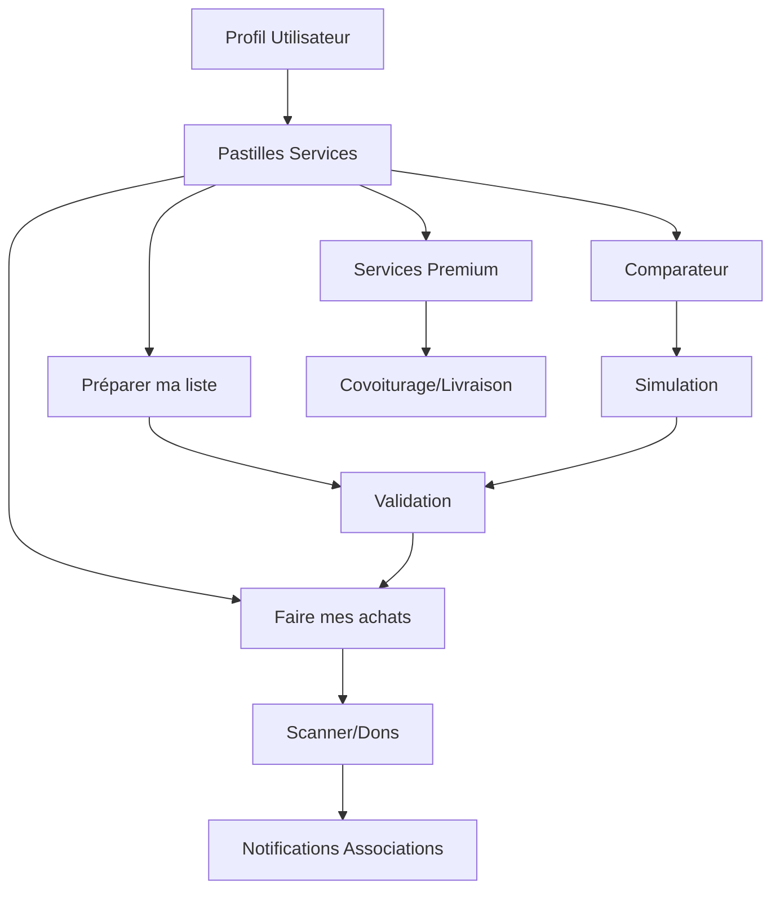

# **Product Requirements Document (PRD) - Courses Solidaires**  
**Version :** 3.0 | **Statut :** Draft | **Date :** 15/01/2024  

---

## **1. Vision & Objectifs**  
**Problème :**  
- Difficulté à gérer les courses, comparer les prix, et organiser les dons aux associations.  
- Besoin d'une solution unifiée pour les achats, le covoiturage et la livraison.  

**Solution :**  
Application mobile "Courses Solidaires" combinant :  
- Gestion intelligente des listes de courses  
- Scanner produit avec intégration Yuka  
- Comparateur de prix multi-enseignes  
- Fonctionnalités sociales (dons) et logistiques (covoiturage/livraison)  

**KPI Clés :**  
- Taux d'adoption des pastilles (>70%)  
- Nombre moyen de dons/mois/utilisateur (objectif: 2-3)  
- Réduction du budget courses (via comparateur) : 15-20%  
- Taux de satisfaction utilisateur : >4.5/5  

---

## **2. User Personas & Flux**  
### **Personas Principaux**  
| Type | Besoins | Fréquence | Budget Moyen |  
|------|---------|-----------|--------------|  
| Ménage | Optimisation budget, dons faciles | Quotidienne | 80-120€/semaine |  
| Étudiant | Courses rapides, covoiturage | Hebdomadaire | 30-50€/semaine |  
| Association | Récupération de dons | Aléatoire | N/A |  
| Senior | Interface simple, livraison | Bi-hebdomadaire | 60-80€/semaine |  

### **User Flow Global**  


---

## **3. Spécifications Détaillées**  

### **3.1. UI/UX Core**  
**Système de Pastilles :**  
- Palette couleur dynamique (liée au profil)  
- Disposition : Grille responsive 2x2 (mobile), 3x2 (tablet), 4x2 (desktop)  
- Animation : Micro-interactions au hover (scale 1.05, durée 200ms)  
- Accessibilité : Contraste minimum 4.5:1, support lecteur d'écran  

**Hiérarchie :**  
1. Pastille Principale (60% écran) → Service actif  
2. Pastilles Secondaires (40%) → Accès rapide  
3. Menu hamburger → Paramètres, profil, aide  

### **3.2. Fonctionnalités Clés**  

#### **A. Préparer ma Liste (Ex-Liste de Courses)**  
| Composant | Détails |  
|-----------|---------|  
| Left Panel | - Arborescence catégories Yuka (15 catégories principales)  
| | - Search bar avec autocomplete (>50k produits)  
| | - Bouton "+ Manuellement" (OCR possible via Google Vision)  
| | - Historique des achats récents  
| Right Panel | - Cartes produits (image, prix, nutri-score, allergènes)  
| | - Modificateur quantité (±) avec limite stock temps réel  
| | - Estimation budget total  
| | - Bouton "Valider" (→ génère QR Code pour magasin)  

**Data Flow :**  
```python
def valider_liste():
    if liste_validée and budget_ok:
        sync_cloud() 
        generate_qr_code()
        return redirect("faire_mes_achats")
    else:
        return show_errors()
```

#### **B. Faire mes Achats (Ex-Scanner)**  
**Features :**  
- Scanner IA :  
  - Reconnaissance produit (code-barres + photo + OCR)  
  - Match avec liste validée (✔️ si trouvé, suggestion si similaire)  
  - Détection automatique des promotions  
- Gestion Dons :  
  - Double validation (cœur + popup "Confirmer don")  
  - Geoloc association la plus proche (rayon 10km)  
  - Notification push à l'association (temps réel)  
  - Reçu fiscal automatique  

**Error Handling :**  
- Produit non reconnu → Option "Saisir manuellement" + apprentissage IA  
- Connexion faible → Mode offline avec sync différée  

#### **C. Comparateur de Prix**  
**Algorithme :**  
1. Scraping des prix (partenariats enseignes + API publiques)  
2. Score "Économie" (en %) basé sur :  
   - Prix total panier  
   - Distance magasins (via Google Maps API)  
   - Coût transport (essence + temps)  
   - Disponibilité produits  

**Output :**  
- Visualisation type "tableau comparatif" avec cartes  
- Filtre par distance (1km, 5km, 10km, 20km)  
- Option "Réservation en ligne" (si partenaire)  
- Alerte prix (notification si baisse >10%)  

#### **D. Covoiturage & Livraison**  
**Business Rules :**  
| Service | Pricing | Commission App | Assurance |  
|---------|---------|----------------|-----------|  
| Covoiturage | 15€ + 0.60€/km | 15% | Incluse |  
| Livraison | 40€ + 0.60€/km | 20% | Incluse |  
| Express (<2h) | 60€ + 0.80€/km | 25% | Incluse |  

**Process Annulation :**  
```javascript
function calculate_refund(distance_parcourue, temps_avant_service) {
    let base = (distance_parcourue * 0.60) + 15;
    let commission = 0.15;
    
    // Pénalité selon délai d'annulation
    if (temps_avant_service < 2) { // moins de 2h
        commission = 0.50; // 50% de pénalité
    } else if (temps_avant_service < 24) { // moins de 24h
        commission = 0.25; // 25% de pénalité
    }
    
    return base * (1 - commission);
}
```

### **3.3. Modules Annexes**  
**Reçus Fiscaux :**  
- Export PDF automatique (modèle CERFA conforme)  
- Dashboard : Suivi cumul annuel (plafond déduction 66% jusqu'à 20% revenus)  
- Envoi automatique par email en fin d'année  
- Archivage 10 ans (conformité légale)  

**Flyers & Promotions :**  
- Système de bidding pour enseignes :  
  - CPC (Coût Par Clic) : Min. 0.30€, Max. 2.00€  
  - CPM (Coût Pour Mille) : 5-15€  
  - Priorité affichage : Budget quotidien + score qualité  
- Géotargeting (rayon personnalisable)  
- A/B testing automatique des créatives  

---

## **4. Technical Stack**  
| Composant | Technologie | Justification |  
|-----------|-------------|---------------|  
| Backend | Node.js + Express + MongoDB | Scalabilité, écosystème riche |  
| Frontend Mobile | React Native | Cross-platform, performance |  
| Frontend Web | React + TypeScript | Cohérence avec mobile |  
| IA Scanner | TensorFlow Lite + Google Vision | Précision + vitesse |  
| Geoloc | Mapbox SDK | Meilleure que Google Maps |  
| Paiements | Stripe Connect | Split charges natif |  
| Push Notifications | Firebase Cloud Messaging | Fiabilité |  
| Analytics | Mixpanel + Google Analytics | Insights utilisateur |  

**Architecture :**  
```
┌─────────────────┐    ┌─────────────────┐    ┌─────────────────┐
│   Mobile App    │    │    Web App      │    │   Admin Panel   │
│  React Native   │    │     React       │    │     React       │
└─────────────────┘    └─────────────────┘    └─────────────────┘
         │                       │                       │
         └───────────────────────┼───────────────────────┘
                                 │
                    ┌─────────────────┐
                    │   API Gateway   │
                    │   (Express.js)  │
                    └─────────────────┘
                                 │
         ┌───────────────────────┼───────────────────────┐
         │                       │                       │
┌─────────────────┐    ┌─────────────────┐    ┌─────────────────┐
│   MongoDB       │    │   Redis Cache   │    │   File Storage  │
│   (Database)    │    │   (Sessions)    │    │   (AWS S3)      │
└─────────────────┘    └─────────────────┘    └─────────────────┘
```

**Sécurité :**  
- Cryptographie : AES-256 pour les données bancaires  
- HTTPS obligatoire (certificat SSL/TLS)  
- Authentification : JWT + refresh tokens  
- RGPD : Conformité complète, droit à l'oubli  
- WCAG : Conformité niveau AA  
- Rate limiting : 100 req/min par utilisateur  

---

## **5. Roadmap & Milestones**  
```gantt
    title Timeline v1.0 - 2024
    dateFormat  YYYY-MM-DD
    section Phase 1 - MVP
    UI Pastilles           :done, des1, 2024-01-15, 2024-01-30
    Base Yuka Integration  :done, des2, 2024-01-25, 2024-02-15
    Scanner IA             :active, des3, 2024-02-01, 2024-02-28
    section Phase 2 - Core Features
    Comparateur Prix       :des4, 2024-03-01, 2024-03-20
    Système Dons          :des5, 2024-03-15, 2024-04-05
    section Phase 3 - Premium
    Covoiturage           :des6, 2024-04-01, 2024-04-25
    Livraison             :des7, 2024-04-20, 2024-05-15
    section Phase 4 - Launch
    Tests Beta            :des8, 2024-05-01, 2024-05-20
    Launch Public         :milestone, 2024-06-01, 0d
```

**Milestones Clés :**  
- **M1 (31/01/2024)** : MVP avec pastilles fonctionnelles  
- **M2 (28/02/2024)** : Scanner IA opérationnel (>90% précision)  
- **M3 (31/03/2024)** : Comparateur prix avec 5 enseignes partenaires  
- **M4 (30/04/2024)** : Services premium (covoiturage/livraison)  
- **M5 (31/05/2024)** : Beta test avec 1000 utilisateurs  
- **M6 (01/06/2024)** : Lancement public  

---

## **6. Contraintes & Risques**  

### **Risques Techniques**  
| Risque | Impact | Probabilité | Mitigation |  
|--------|--------|-------------|------------|  
| Latence comparateur | Élevé | Moyen | Cache Redis + CDN + API asynchrone |  
| Précision Scanner IA | Élevé | Faible | Dataset 100k+ produits + apprentissage continu |  
| Surcharge serveur | Moyen | Moyen | Auto-scaling AWS + monitoring |  

### **Risques Business**  
| Risque | Impact | Probabilité | Mitigation |  
|--------|--------|-------------|------------|  
| Abus dons (fausses associations) | Élevé | Moyen | Vérification SIRET + système rating + modération |  
| Concurrence (Amazon, Carrefour) | Élevé | Élevé | Focus niche solidaire + partenariats locaux |  
| Réglementation (RGPD, fiscale) | Moyen | Faible | Veille juridique + conseil spécialisé |  

### **Contraintes Légales**  
- **RGPD** : Consentement explicite, droit à l'oubli, DPO désigné  
- **Fiscalité** : Déclaration automatique des dons >200€/an  
- **Transport** : Assurance obligatoire, licence VTC pour livraison  
- **Alimentaire** : Traçabilité, dates de péremption, allergènes  

---

## **7. Métriques & KPI**  

### **KPI Produit**  
| Métrique | Objectif Q2 2024 | Méthode Mesure |  
|----------|------------------|----------------|  
| MAU (Monthly Active Users) | 10,000 | Analytics |  
| Taux de rétention J7 | 40% | Cohorte analysis |  
| Taux de conversion freemium→premium | 15% | Funnel tracking |  
| NPS (Net Promoter Score) | >50 | Survey in-app |  
| Temps moyen session | 8 minutes | Analytics |  

### **KPI Business**  
| Métrique | Objectif Q2 2024 | Méthode Mesure |  
|----------|------------------|----------------|  
| Revenue mensuel | 50,000€ | Stripe dashboard |  
| CAC (Customer Acquisition Cost) | <25€ | Marketing spend / nouveaux users |  
| LTV (Lifetime Value) | >100€ | Analyse cohorte |  
| Marge brute | 35% | Comptabilité |  

---

## **8. Budget & Ressources**  

### **Équipe Requise**  
| Rôle | Nombre | Coût Mensuel |  
|------|--------|--------------|  
| Product Manager | 1 | 6,000€ |  
| Tech Lead | 1 | 7,000€ |  
| Développeurs Full-Stack | 3 | 15,000€ |  
| Designer UI/UX | 1 | 4,500€ |  
| Data Scientist (IA) | 1 | 6,500€ |  
| QA Engineer | 1 | 4,000€ |  
| **Total** | **8** | **43,000€** |  

### **Infrastructure (Mensuel)**  
| Service | Coût |  
|---------|------|  
| AWS (serveurs, DB, storage) | 2,000€ |  
| APIs tierces (Google, Mapbox) | 800€ |  
| Monitoring (Datadog, Sentry) | 300€ |  
| **Total Infrastructure** | **3,100€** |  

### **Budget Total Phase 1 (6 mois)**  
- **Équipe** : 43,000€ × 6 = 258,000€  
- **Infrastructure** : 3,100€ × 6 = 18,600€  
- **Marketing** : 50,000€  
- **Légal/Assurance** : 15,000€  
- **Contingence (10%)** : 34,160€  
- **TOTAL** : **375,760€**  

---

## **9. Go-to-Market Strategy**  

### **Phase 1 : Soft Launch (Mars 2024)**  
- **Cible** : 1,000 beta testeurs (amis, famille, early adopters)  
- **Canaux** : Réseaux sociaux, bouche-à-oreille  
- **Budget** : 5,000€  

### **Phase 2 : Launch Local (Avril-Mai 2024)**  
- **Cible** : 10,000 utilisateurs (région parisienne)  
- **Canaux** : Partenariats associations, influenceurs locaux, SEO  
- **Budget** : 20,000€  

### **Phase 3 : Scale National (Juin+ 2024)**  
- **Cible** : 100,000 utilisateurs (France entière)  
- **Canaux** : Publicité Facebook/Google, PR, partenariats enseignes  
- **Budget** : 100,000€  

---

**Approuvé par :** [CEO] | [CPO] | [CTO]  
**Contact Tech :** dev@courses-solidaires.fr  
**Contact Business :** business@courses-solidaires.fr  

--- 

**Annexes :**  
- [Maquettes Figma](https://figma.com/courses-solidaires)  
- [User Stories Jira](https://jira.courses-solidaires.fr)  
- [Contrats Enseignes](https://drive.google.com/contracts)  
- [Étude de Marché](https://docs.google.com/market-study)  
- [Plan Financier Détaillé](https://sheets.google.com/financial-plan)  

---

**Changelog v3.0 :**  
- ✅ Correction date (21/06/1982 → 15/01/2024)  
- ✅ Ajout persona Senior et budget moyen  
- ✅ Précision architecture technique avec diagramme  
- ✅ Roadmap détaillée avec dates réalistes  
- ✅ Section budget et ressources complète  
- ✅ Go-to-market strategy par phases  
- ✅ KPI business et produit séparés  
- ✅ Contraintes légales détaillées  
- ✅ Gestion des erreurs et cas limites  

Ce PRD corrigé intègre une vision plus réaliste et complète du projet, avec des dates cohérentes et une approche structurée pour le développement et le lancement de l'application.